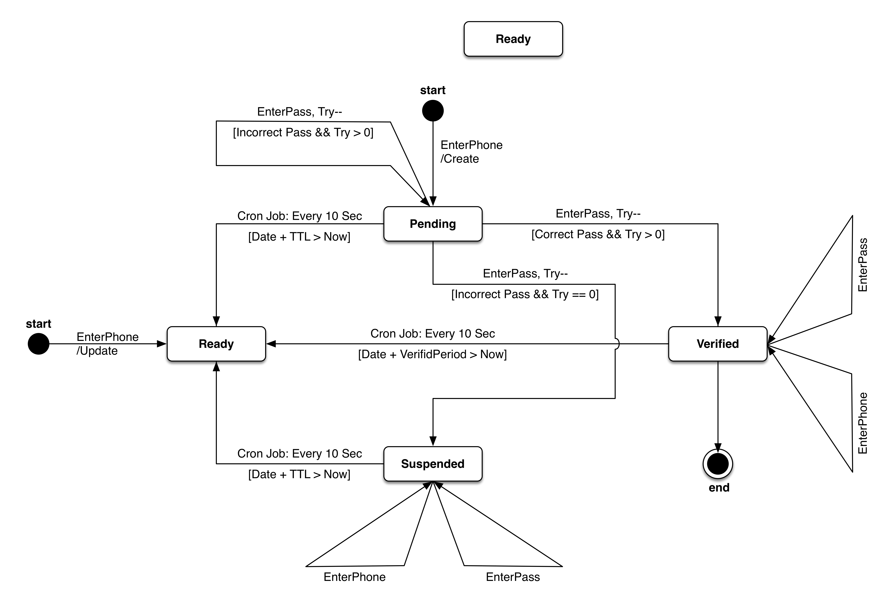
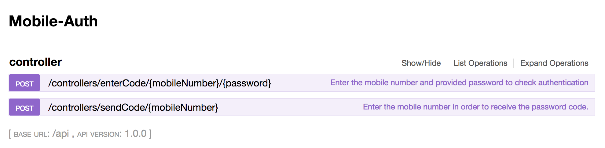
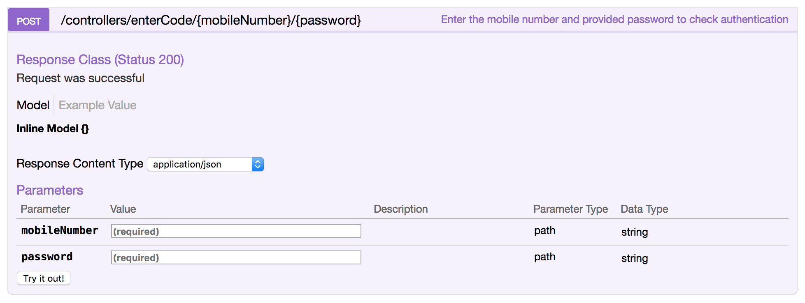
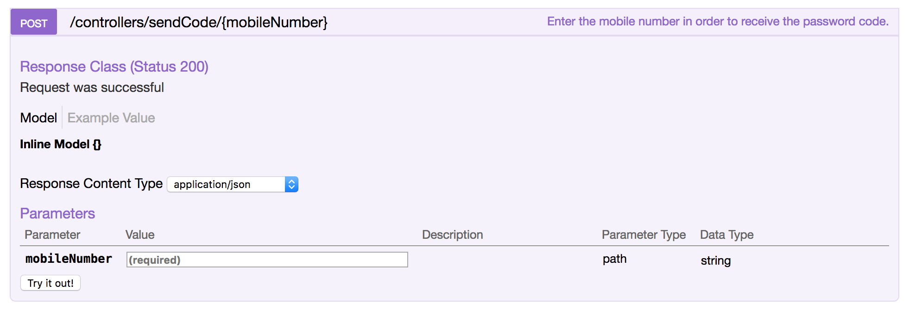

# Mobile-Auth
With this phone verification tool, you can validate phone numbers as they are collected from different channels. In addition to validating phone numbers, you can also identify whether the number is a landline or mobile, to assist ensuring compliance with regulators.

---
## Philosophy

* **One Auth, Everywhere:** The explosion in mobile usage has fundamentally changed the way people interact with brands. I understand how important it is to reach out to clients in a timely manner. For this purpose, I created a free, easy-to-use phone verification web service that will ultimately lead to increased customer satisfaction, better retention, improved productivity and life-time value. 

* **No Configuration Required:** You don't need to configure anything. Reasonably good configuration of both development and production builds is handled for you so you can focus on writing code and taking the most advantages of the service.

* **Your Own Messaging Service:** There are plenty of great Messaging (SMS) Services around the world for each country and its operator. Therefore, I decided to leave your hands open in choosing and implementing the right messaging service that exactly fits your requirements. You need to implement its API through the project. Don't Worry! It will only takes up to 10 to 15 lines of codes.

---
## State Machine Diagram
According to the diagram, Every user model will be located only in one state at a time. User's current state may become changed due to either user interactions or system analysis.


---
## Getting Started

These instructions will get you a copy of the project up and running on your local machine for development and testing purposes. 

### Dependencies
lists the packages that the project depends on and allows to specify the versions of a package that the project mat use using semantic versioning rules. makes your build reproducible, and therefore much easier to share with other developers.
```json
    "compression":	 		"^1.0.3",
    "cors": 				"^2.5.2",
    "cron":	 			"^1.2.1",
    "helmet": 				"^1.3.0",
    "http-errors": 			"^1.6.2",
    "loopback": 			"^3.0.0",
    "loopback-boot": 			"^2.6.5",
    "loopback-component-explorer": 	"^4.0.0",
    "loopback-connector-mongodb": 	"^1.18.1",
    "serve-favicon": 			"^2.0.1",
    "strong-error-handler": 		"^2.0.0"
```

### Installation
Please install the following dependencies before building Mobile-Auth. This is the recommended way to install dependencies on your machine.
```sh
$ npm install
```
### Implementing Message Service
After buidling the project, It's time to implement your message service API for sending sms to users. Of course you should send the password (and any other information you may be considered for marketing aspect) to the user phone number.

In order to implement, navigate to `commin/models/controller.js` and you will see a `sendSMS()` function:
```js
  function sendSMS(mobileNumber, randomPassword, cb) {
		// You should implement your desired messaging service API call here.
  }
```
### Running Web Service
Once you have installed the dependencies, You can run the development instance webservice which is listening on port 5050. You can change the port in config.json file later on. 
```sh
$ node .
  Web server listening at: http://localhost:5050
  Browse your REST API at http://localhost:5050/explorer
```

---
## API References
By browing the `http://localhost:5050/explorer` you can visualy watch the GUI API. Another great way to learn more about the routes and APIs included with Mobile Auth is to read their source. Look under the `common/models` directory for models like basic and controller. From the source and provided diagram you can get an accurate understanding of each route's behavior and API.



### Send Phone Number
In order to send a random password to a particular phone number you need to invoke this API by providing the phone number.



#### Http responce status codes
* 200: Successful Operation, Password is valid only for TTL period. 
* 423: Suspended (Locked), User is temporary suspended for TTL Period.

### Password Verification
In order to valide the password and phone number you need to invoke this API by providing the phone number and password.



#### Http responce status codes
* 200: Successful Operation, User is verified for 6 Days. 
* 404: Faild Operation, Invoking the phone number is required first.
* 423: Suspended (Locked), User is temporary suspended for TTL Period.

---
## Credits
This project is inspired by the work of Filimo authentication. They inspiringly showed that in this day and age it is still possible to reduce the time users spend for authentication. 

---
## Contributing
I actively welcome contributions from the community and would like to have your helping hand on Mobile-Auth! For more information on what I'm looking for and how to get started, Feel free to contact me. You are welcome to add any feature.

---
## Licence
The MIT License (MIT)

Copyright (c) 2018 Alirëza WJ Arabi

Permission is hereby granted, free of charge, to any person obtaining a copy of this software and associated documentation files (the "Software"), to deal in the Software without restriction, including without limitation the rights to use, copy, modify, merge, publish, distribute, sublicense, and/or sell copies of the Software, and to permit persons to whom the Software is furnished to do so, subject to the following conditions:

The above copyright notice and this permission notice shall be included in all copies or substantial portions of the Software.

THE SOFTWARE IS PROVIDED "AS IS", WITHOUT WARRANTY OF ANY KIND, EXPRESS OR IMPLIED, INCLUDING BUT NOT LIMITED TO THE WARRANTIES OF MERCHANTABILITY, FITNESS FOR A PARTICULAR PURPOSE AND NONINFRINGEMENT. IN NO EVENT SHALL THE AUTHORS OR COPYRIGHT HOLDERS BE LIABLE FOR ANY CLAIM, DAMAGES OR OTHER LIABILITY, WHETHER IN AN ACTION OF CONTRACT, TORT OR OTHERWISE, ARISING FROM, OUT OF OR IN CONNECTION WITH THE SOFTWARE OR THE USE OR OTHER DEALINGS IN THE SOFTWARE.